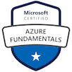

### Hi there i am Niklas 👋
 
I'm specialising in the design and architecture of Microsoft environments with main emphasis on Modern Devicemanagement and Microsoft Azure services.
Currently im employed by Operational services GmbH & Co. KG and i am the product manager for Microsoft Endpoint Manager.
  

  

*Read more about me and my projects [here](https://niklasrast.github.io/)*

### Technology stack
 

### Certifications

### My Github stats
 

  

  

